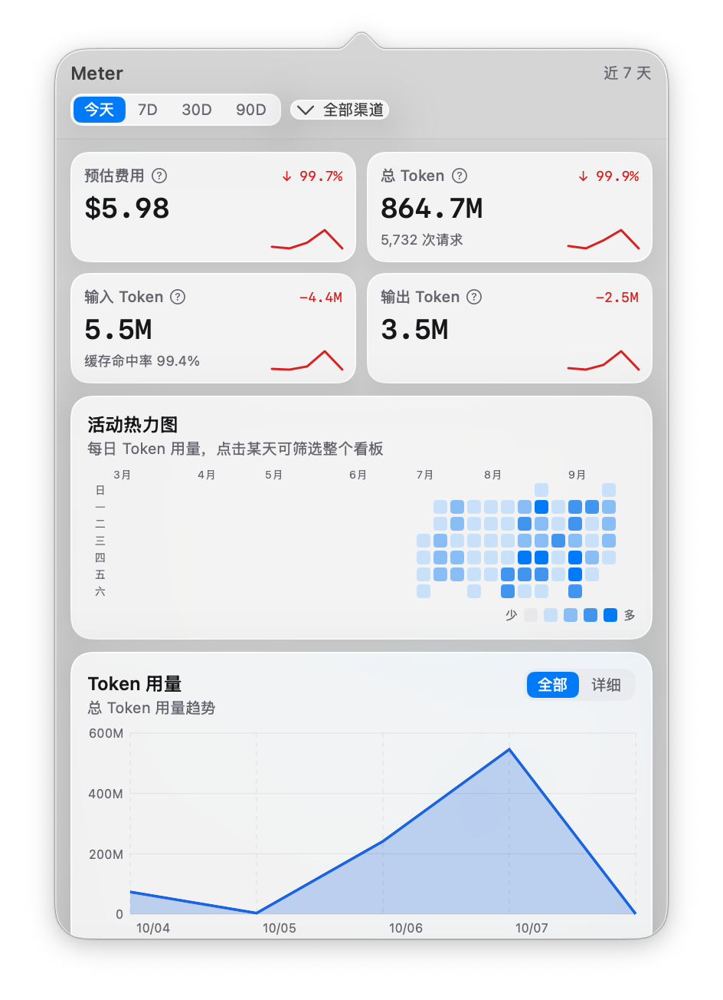
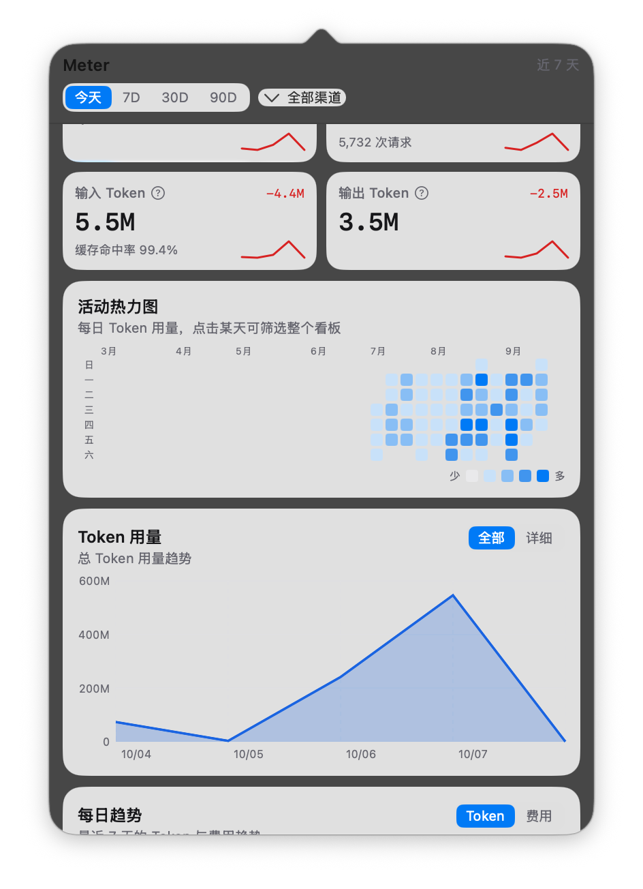
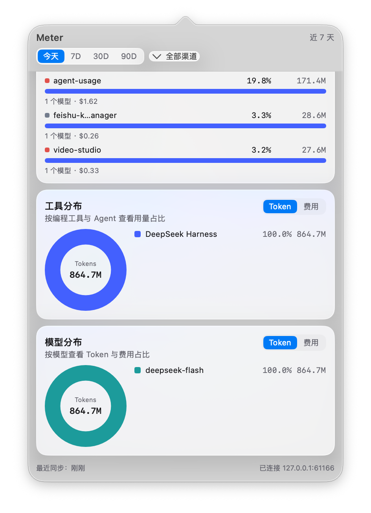
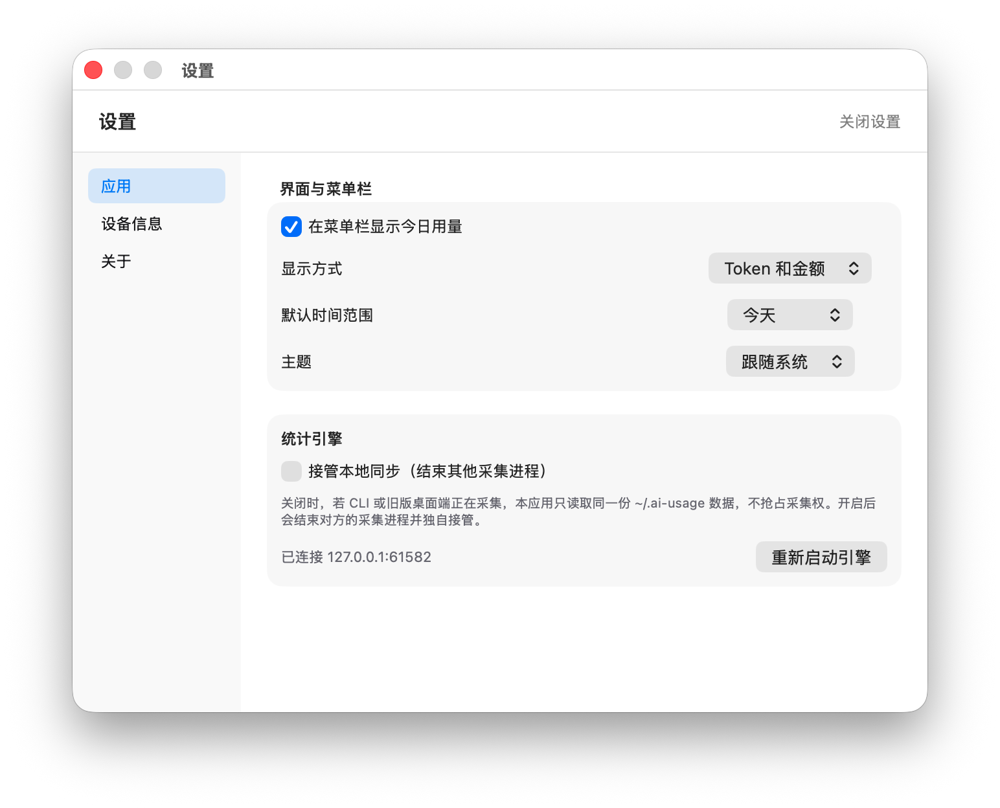
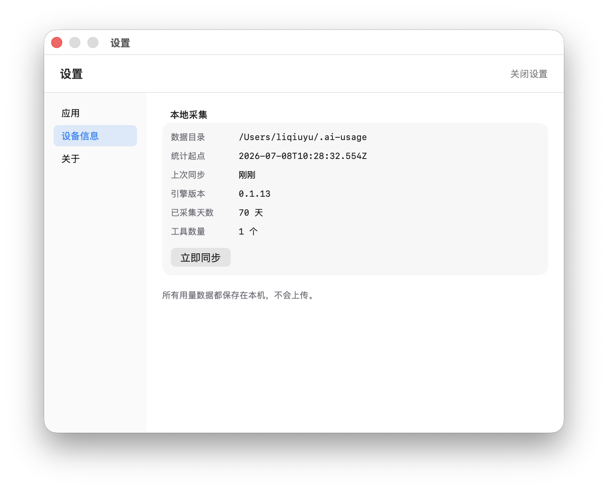
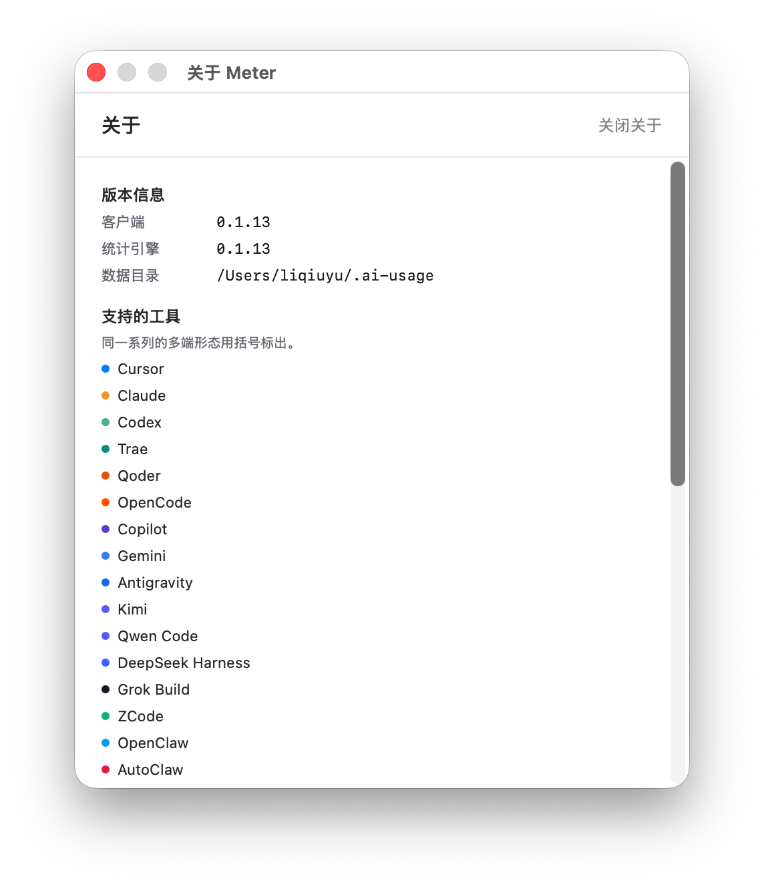
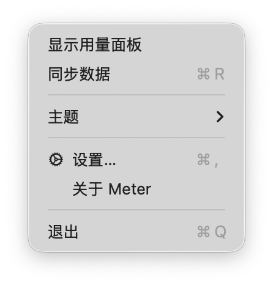

<p align="center">
  <picture>
    <source media="(prefers-color-scheme: dark)" srcset="./assets/logo-dark.png">
    
  </picture>
</p>

<h1 align="center">Meter</h1>

<p align="center">
  <b>常驻 macOS 菜单栏的 AI 编码用量仪表盘</b><br>
  原生 SwiftUI（macOS 26 · Liquid Glass）· 本地解析日志 · 不上报任何数据
</p>

<p align="center">
  
  
  
  
</p>

<p align="center">
  <a href="https://github.com/tordorlex/agent-usage/releases">下载安装包</a> ·
  <a href="#-界面">界面截图</a> ·
  <a href="#-功能">功能</a> ·
  <a href="#-快速开始">快速开始</a> ·
  <a href="./FAQ.md">常见问题</a> ·
  <a href="#-与上游的关系">与上游的关系</a> ·
  <a href="./README.en.md">English</a>
</p>

<p align="center">
  <br>
  <sub>用量面板：四张指标卡 + 52 周活动热力图，<b>点某一天即可把整个看板筛选到那天</b></sub>
</p>

## 🎯 Meter 是什么

Meter 是一个**跑在 macOS 菜单栏上的 AI 编码用量仪表盘**。它读取本机各种 Agent / 编码工具留下的日志
（Claude Code、Codex、Cursor、Gemini CLI……共 37 种），按统一口径算出 Token 用量与预估费用，
再用原生 SwiftUI 面板展示出来——不注册账号、不登录、不上传。

| | |
|---|---|
| **原生客户端** | SwiftUI + Liquid Glass，不是套壳网页；无主窗口，界面就是菜单栏图标弹出的面板 |
| **本地优先** | 所有解析与聚合都在这台机器上完成，数据落在 `~/.ai-usage` |
| **不上报** | 引擎内云端上报被强制关闭（`juejin.enabled = false`），配置接口也无法重新打开 |
| **口径统一** | 与同仓库的 CLI / Electron 端共用同一份数据、同一套聚合口径，两版数字能对上 |
| **常驻可见** | 菜单栏直接显示今日用量（`1.2M Token · $3.40`，三种显示方式可切换） |
| **双语** | 界面中英双语，默认跟随 macOS 语言，也可在设置里固定 |

## 🖼️ 界面

面板从上到下依次是：用量总览（四张指标卡 + 52 周活动热力图，见顶部大图）、趋势图表、
项目 / 工具 / 模型分布，最后是同步状态栏。下面按顺序展示。

### 趋势图表

<p align="center">
  
</p>

用 Swift Charts 绘制：**总 Token 用量趋势**（可在「全部 / 详细」之间切换）与**每日 Token 与费用趋势**，
纵轴自动按 T / B / M / K 取单位，切换时间范围即时重算。

### 项目 / 工具 / 模型分布

<p align="center">
  
</p>

三个维度看用量去向：**项目分布**（按工作目录，仅本地展示）、**工具分布**、**模型分布**；
堆叠条与环形图都能在 Token / 费用两种口径间切换，环形图还能逐项隐藏。

### 设置与关于

<table>
  <tr>
    <td align="center"></td>
    <td align="center"></td>
  </tr>
  <tr>
    <td align="center"><sub>设置 · 菜单栏显示方式、默认时间范围、主题、统计引擎</sub></td>
    <td align="center"><sub>设置 · 数据目录、统计起点、上次同步、引擎状态</sub></td>
  </tr>
</table>

<table>
  <tr>
    <td align="center"></td>
    <td align="center"></td>
  </tr>
  <tr>
    <td align="center"><sub>关于：客户端版本、统计引擎、支持的工具</sub></td>
    <td align="center"><sub>右键菜单：同步 / 主题 / 设置 / 退出</sub></td>
  </tr>
</table>

## ✨ 功能

| 能力 | 说明 |
|---|---|
| 用量概览 | 预估费用、总 Token、输入 / 输出 Token，含缓存命中率与相邻两天变化 |
| 活动热力图 | 52 周每日用量，点击某天把整个看板筛选到那天 |
| 趋势图 | 总 Token 用量趋势（全部 / 详细）、每日 Token 与费用趋势 |
| 分布视图 | 工具与模型用量（堆叠条）、项目分布、工具分布 / 模型分布（环形图） |
| 筛选 | 今天 / 7D / 30D / 90D 时间范围；渠道多选筛选（按占比缩放当日数据） |
| 菜单栏 | 常驻显示今日用量，可选「Token 和金额 / 仅 Token / 仅金额」，也可只显示图标 |
| 外观 | 跟随系统 / 浅色 / 深色 |
| 语言 | 默认跟随 macOS 语言（简体中文 / English），也可在设置里固定 |
| 采集权 | 默认只读同一份 `~/.ai-usage`；可一键接管，结束其他采集进程 |
| 数据 | 本地目录、统计起点、上次同步、引擎版本、已采集天数一目了然，可手动触发同步 |

明确**不做**的部分（这是它与上游桌面端最大的区别）：

| 不做 | 原因 |
|---|---|
| 掘金登录 / 云端上报 / 排行榜 / 分享 | 只做本机统计，引擎里上报通道被强制关闭 |
| 桌面宠物 | 与用量统计无关 |
| 自动更新 / 开机自启 | 保持一个「打开就用、不常驻后台服务」的小工具 |
| 订阅额度卡片 | 需要抓取各厂商凭据，不在本地优先的范围内 |

## 🔧 工作原理

App 本身不解析任何日志：启动时会拉起一个无界面的 Node 边车（`packages/engine`）作为统计引擎，
双方通过 stdout 握手拿到端口，之后走 localhost HTTP 调用同一套 `/functions/tud-*` 契约。

```
┌──────────────┐   spawn    ┌──────────────────────┐   HTTP    ┌──────────────────────┐
│  Meter.app   │──────────▶│ node + packages/engine│──────────▶│ packages/core 运行时  │
│  (SwiftUI)   │◀──────────│  (stdout 握手 + 端口)  │           │  解析 / 聚合 / 定价    │
└──────────────┘  handshake └──────────────────────┘           └──────────┬───────────┘
                                                                          │
                                                              ~/.ai-usage（与 CLI 共享）
```

- 引擎崩溃会自动重启，设置里也能手动「重新启动引擎」；
- 打包版把 Node 运行时和引擎一起塞进 `.app`（约 123 MB，绝大部分是 Node），用户机器上无需安装任何东西；
- 数据层零改动，因此 CLI、旧版 Electron 端与 Meter 看到的是同一份数据、同一套口径。

## 🚀 快速开始

### 下载安装包

前往 [Releases](https://github.com/tordorlex/agent-usage/releases) 下载 `Meter-<版本>.dmg`，拖进「应用程序」即可。

> App 目前是 ad-hoc 签名、未做公证。首次打开若提示「已损坏」，在终端执行
> `sudo xattr -dr com.apple.quarantine /Applications/Meter.app`，或右键「打开」。

### 从源码构建

需要 **macOS 26 + Xcode 26**（Liquid Glass API 与部署目标都是 26.0）以及 Node.js 20+。

```bash
pnpm install

# 直接开发运行（在仓库里解析引擎脚本，用 PATH 上的 node）
pnpm dev:macos

# 打出可双击的 .app（内嵌 Node + 引擎）
pnpm build:macos:app        # → apps/macos/dist/Meter.app

# 打成可分发的 .dmg
pnpm build:macos:dmg        # → apps/macos/dist/Meter-<版本>.dmg
```

### 命令行版（可选，同一份数据）

仓库里同时保留着上游的命令行与本地面板，和 Meter 共用 `~/.ai-usage`：

```bash
npm i -g @juejin-opensource/jusage
jusage service start
# 面板: http://127.0.0.1:8452
```

完整命令与选项见 [CLI 使用说明](./CLI.md)。

## 🔒 数据与隐私

Meter 只做本地统计。所有用量明细、模型名、来源渠道与项目路径都只写在本机。

| 项 | 位置 |
|---|---|
| 数据目录 | `~/.ai-usage`（可用 `JUSAGE_DATA_DIR` 覆盖） |
| 日志 | `~/.ai-usage/logs/` |
| 设备 ID | `~/.config/jusage/device-id` |
| 定价覆盖层 | `~/.ai-usage/pricing-overlay.json` |

- 🚫 **不采集、不上传**：对话内容、Prompt 文本、代码内容与 API Key——解析只提取 Token 计数、
  模型名与用量元数据，而且全部留在本机；
- 🚫 **不上传**：云端上报在引擎里被强制关闭，`PUT /functions/tud-config` 也无法重新打开；
- 🌐 **唯一的对外请求**：启动时拉取一次公开的模型定价表
  （`https://api.juejin.cn/aiusage_api/functions/tud-pricing`，不轮询）。拉不到就用磁盘上一版，
  再没有就用内置价表，不影响任何统计；
- 🔁 **采集权**：同一时刻只有一个进程通过 `~/.ai-usage/tud.pid` 做采集。Meter 默认**不抢占**——
  若 CLI 或 Electron 端正在采集，它只以 observer 身份读取同一份数据；需要独占时在设置里打开「接管本地同步」；
- 🎛️ **随时清除**：删除 `~/.ai-usage` 目录即可清空全部本地记录。

## 🧰 支持的工具

共 37 种，同一系列的不同形态会归并到一行：

<sub>Cursor · Claude · Codex · Trae · Qoder · OpenCode · Copilot · Gemini · Antigravity · Kimi ·
Qwen Code · DeepSeek Harness · Grok Build · ZCode · OpenClaw · AutoClaw · Hermes · Roo Code ·
Kilo Code · Kilo CLI · Cline · Goose · Zed · Warp · Droid · Kiro · Amp · Mimo · CodeBuddy ·
WorkBuddy · pi · OMP · Every Code · QwenWork · Command Code · MiniMax Code · WPS Comate</sub>

## 🧱 仓库结构

| 路径 | 职责 |
|---|---|
| `apps/macos` | **Meter 本体**：原生 SwiftUI 菜单栏客户端（macOS 26 + Liquid Glass） |
| `packages/engine` | 无界面 Node 边车：把 core 运行时以 localhost HTTP + stdout 握手交给原生宿主 |
| `packages/core` | 各家 Agent 日志解析、用量队列、聚合缓存、定价与 local-api 契约 |
| `packages/cli` | `jusage`：HTTP 服务 + 托管 dashboard |
| `packages/dashboard` | CLI 内置面板（与线上 `/aiusage/` 同一份） |
| `apps/desktop` | 上游 Electron 端（待移除） |

原生端的构建、代码结构与踩坑记录见 [apps/macos/README.md](./apps/macos/README.md)。

## 🙏 与上游的关系

本仓库 [agent-usage](https://github.com/tordorlex/agent-usage) 是
**[稀土掘金 · juejin-cn/juejin-usage](https://github.com/juejin-cn/juejin-usage)** 的衍生项目：
日志解析、聚合口径、定价表与 `/functions/tud-*` 契约全部来自原项目，本仓库在其之上补了一个原生 macOS 客户端。

**由衷感谢** [juejin-cn](https://github.com/juejin-cn) 团队与
[上游全体贡献者](https://github.com/juejin-cn/juejin-usage/graphs/contributors)——没有原项目就没有这个仓库。
上游采用 MIT 许可证（Copyright (c) 2026 juejin-cn），本仓库沿用同一许可证。

原项目链接：[上游仓库](https://github.com/juejin-cn/juejin-usage) ·
[Releases](https://github.com/juejin-cn/juejin-usage/releases) ·
[Issues](https://github.com/juejin-cn/juejin-usage/issues)

## 🤝 贡献

分支规范、本地启动与测试方式见 [Contributing Guide](./CONTRIBUTING.md)。提交前请确保 `pnpm build` 与 `pnpm test` 通过。

- 联系 Captain：229199157

## 📚 参考项目

- [Token Tracker](https://github.com/xiufengsun/TokenTracker)：自动采集 30 款 AI 编码工具的 token 用量，用一套漂亮的 Dashboard 看真实成本与趋势
- [vibe-usage](https://github.com/vibe-cafe/vibe-usage)：Token 使用量统计工具（CLI）
- [OpenUsage](https://github.com/robinebers/openusage)：The Only AI Usage Tracker That's Truly Yours
- [models.dev](https://models.dev)：模型 Token 计价数据源，内置计价表由此增量同步

## 📄 许可证

[MIT](./LICENSE)
